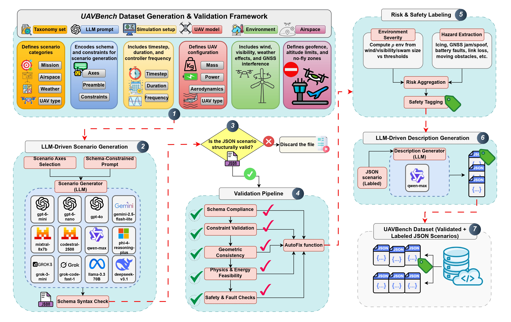
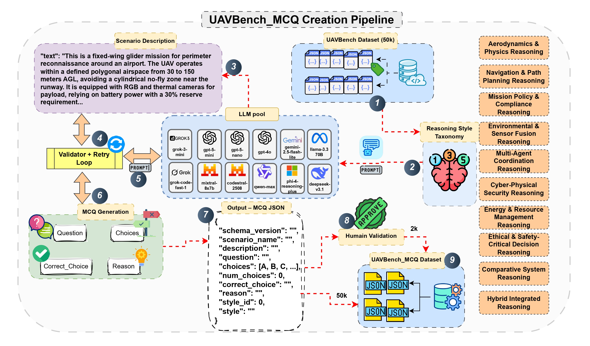
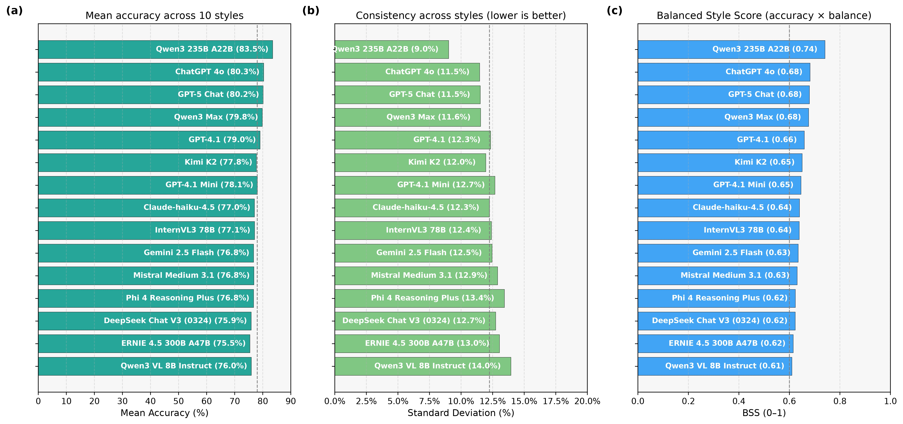

# UAVBench: An Open Benchmark Dataset for Autonomous and Agentic AI UAV Systems via LLM-Generated Flight Scenarios

## Overview
**UAVBench** is an open, physically grounded benchmark dataset for evaluating **autonomous aerial systems** enhanced by **Large Language Models (LLMs)**.  
It provides a unified framework for generating, validating, and reasoning over UAV flight scenarios, enabling systematic assessment of **agentic AI reasoning** in mission planning, perception, and decision-making.

UAVBench introduces:
- **50,000 validated UAV flight scenarios**, generated using taxonomy-guided LLM prompting and multi-stage safety validation.  
- **UAVBench_MCQ**, a reasoning-oriented extension containing **50,000 multiple-choice questions (MCQs)** across ten reasoning styles—from aerodynamics and navigation to ethics and hybrid cognition.

Together, these datasets establish a **reproducible, interpretable, and physics-grounded foundation** for benchmarking cognitive and ethical reasoning in UAV autonomy.

---
## Research Questions
UAVBench is designed to answer key questions in autonomous aerial reasoning:
- How can LLM-generated UAV scenarios remain physically consistent and safety-aware?  
- What methods ensure interpretable and risk-labeled UAV missions?  
- How can reasoning tasks evaluate ethical and cognitive dimensions of UAV autonomy?  
- How do model architectures influence grounded reasoning and decision reliability?

---

## Motivation
Modern UAVs increasingly depend on **LLMs** for autonomous decision-making, yet the field lacks **standardized and physically consistent benchmarks** to measure reasoning quality.  
Most existing UAV datasets are limited by simplified environments, low-fidelity simulators, or narrow task scopes that overlook real-world physics and safety constraints.

**UAVBench** addresses this gap by:
- Capturing realistic 3D flight dynamics, environmental variability, and mission-level goals.
- Enforcing **schema compliance**, **physical feasibility**, and **risk labeling** across all generated scenarios.
- Enabling structured reasoning tasks to evaluate **LLM-based UAV cognition** in real-world operational contexts.

---

## Key Features




### 🧩 1. Unified UAV Scenario Schema
A mathematically defined schema encodes each UAV mission as a structured tuple, integrating:
- Simulation dynamics  
- Vehicle configuration  
- Environmental conditions  
- Mission objectives and safety constraints  

This ensures **interoperability**, **physical validity**, and **semantic diversity** across applications.

### 🌦️ 2. Taxonomy-Guided Scenario Generation
Using taxonomy-driven LLM prompting, UAVBench samples from a factorized space of:
- Mission types  
- Airspace configurations  
- Weather conditions  
- UAV designs and payloads  

This yields **50,000 validated, safety-aware flight scenarios** suitable for both model training and evaluation.

### ⚙️ 3. Multi-Stage Validation and Risk Labeling
Each scenario undergoes:
- Schema validation  
- Physical and geometric consistency checks  
- Safety and hazard-aware risk scoring  

Scenarios are labeled with **quantitative risk levels** and categorical tags such as:
`Weather`, `Navigation`, `Energy`, and `Collision-Avoidance`.

### 🧠 4. UAVBench_MCQ: Structured Reasoning Benchmark



The UAVBench_MCQ extension transforms validated scenarios into **50,000 reasoning tasks**, covering ten UAV reasoning domains:
1. Aerodynamics & Physics  
2. Navigation & Path Planning  
3. Policy & Compliance  
4. Environmental Sensing  
5. Multi-Agent Coordination  
6. Cyber-Physical Security  
7. Energy Management  
8. Ethical Decision-Making  
9. Comparative Systems  
10. Hybrid Integrated Reasoning  

Each MCQ is machine-readable, logically consistent, and aligned with real-world UAV operations.

## Available Datasets
There are currently two types of datasets available: **UAVBench** and **UAVBench_MCQ**.

**1. UAVBench**: Briefly, UAVBench introduces a unified schema for UAV flight scenarios, featuring 50,000 validated missions that integrate airspace configurations, weather conditions, UAV dynamics, and payload specifications. The payload taxonomy covers various sensor types — including RGB, thermal, LiDAR, and multispectral systems — each linked to altitude, lighting, and operational constraints. Every scenario is validated through a multi-stage risk labeling pipeline that ensures geometric, physical, and operational consistency.

<details>
<summary>Click to expand JSON example</summary>

```json
{
  "name": "battery_emergency_forced_landing_harbor_fog",
  "sim": {
    "dt": 0.02,
    "duration_steps": 1200,
    "policy_frequency": 20
  },
  "uav": {
    "type": "hexacopter",
    "mass_kg": 5.2,
    "battery_Wh": 1200.0,
    "fuel_L": 0,
    "energy_source": "battery",
    "max_speed_mps": 18.0,
    "max_tilt_deg": 30,
    "reserve_fraction": 0.3,
    "battery_model": {
      "hover_power_W": 176.8,
      "k_drag": 0.15,
      "k_manoeuvre": 40
    },
    "rotorcraft": {
      "rotor_count": 6,
      "disk_area_m2": 1.8,
      "max_climb_mps": 6.0,
      "hover_ceiling_m": 1200
    },
    "aero": {
      "wing_area_m2": 0.8,
      "aspect_ratio": 6.5,
      "cl_max": 1.4,
      "cd0": 0.03,
      "prop_efficiency": 0.85,
      "stall_speed_mps": 10.5
    },
    "sensors": {
      "gnss": true,
      "imu": true,
      "magnetometer": true,
      "barometer": true,
      "lidar": false,
      "radar": true,
      "camera_rgb": true,
      "camera_thermal": true
    },
    "payloads": [
      {
        "type": "thermal_camera_lwir",
        "category": "imaging_thermal",
        "mass_kg": 0.45,
        "power_W": 18,
        "drag_cdA": 0.008,
        "mount": "gimbal",
        "data": {
          "stream": "video",
          "bitrate_mbps": 4.2,
          "storage_GB": 64
        },
        "operating": {
          "fov_deg": 55,
          "range_m": 800,
          "resolution": "640x512@30",
          "wavelength": "LWIR"
        },
        "constraints": {
          "min_alt_m": 30,
          "max_alt_m": 150,
          "day_night": "both",
          "weather_ok": [
            "clear",
            "fog",
            "light_rain"
          ]
        }
      },
      {
        "type": "lidar",
        "category": "imaging_advanced",
        "mass_kg": 0.7,
        "power_W": 45,
        "drag_cdA": 0.012,
        "mount": "belly",
        "data": {
          "stream": "pointcloud",
          "bitrate_mbps": 8.0,
          "storage_GB": 128
        },
        "operating": {
          "fov_deg": 360,
          "range_m": 120,
          "resolution": "10cm"
        },
        "constraints": {
          "min_alt_m": 20,
          "max_alt_m": 100,
          "day_night": "both"
        }
      }
    ]
  },
  "environment": {
    "airspace": "harbor",
    "weather": {
      "wind_mps": 6.2,
      "wind_dir_deg": 240,
      "gust_mps": 3.8,
      "visibility": "low",
      "phenomena": [
        "fog",
        "low_visibility"
      ]
    },
    "wind_profile": [
      {
        "alt_m": 0,
        "wind_mps": 6.2,
        "dir_deg": 240
      },
      {
        "alt_m": 50,
        "wind_mps": 7.1,
        "dir_deg": 245
      },
      {
        "alt_m": 100,
        "wind_mps": 7.8,
        "dir_deg": 250
      }
    ],
    "gnss_multipath": true,
    "gnss_jam_dbm": -110,
    "em_interference": true
  },
  "airspace": {
    "altitude_agl_min_m": 10,
    "altitude_agl_max_m": 150,
    "geofence": [
      {
        "type": "polygon",
        "points": [
          [
            0.0,
            0.0
          ],
          [
            800.0,
            0.0
          ],
          [
            800.0,
            600.0
          ],
          [
            0.0,
            600.0
          ]
        ]
      }
    ],
    "no_fly_zones": [
      {
        "type": "cylinder",
        "center": [
          400.0,
          300.0
        ],
        "radius_m": 50,
        "floor_m": 10,
        "ceiling_m": 150
      }
    ],
    "no_fly_zones_dynamic": [
      {
        "type": "cylinder",
        "center": [
          200.0,
          150.0
        ],
        "radius_m": 30,
        "floor_m": 15,
        "ceiling_m": 60,
        "vel_xy": [
          1.5,
          0.8
        ]
      }
    ]
  },
  "spawn": {
    "xyz": [
      100.0,
      100.0,
      30.0
    ],
    "yaw_deg": 90
  },
  "landing": {
    "emergency_sites": [
      [
        700.0,
        500.0,
        0.0
      ],
      [
        600.0,
        100.0,
        0.0
      ]
    ]
  },
  "mission": {
    "type": "inspection",
    "waypoints": [
      [
        150.0,
        150.0,
        40.0
      ],
      [
        300.0,
        200.0,
        50.0
      ],
      [
        500.0,
        250.0,
        45.0
      ],
      [
        600.0,
        400.0,
        35.0
      ],
      [
        700.0,
        500.0,
        30.0
      ]
    ],
    "pattern": "corridor",
    "time_budget_s": 600,
    "runway_required": false
  },
  "traffic": [
    {
      "type": "uav",
      "spawn": [
        750.0,
        550.0,
        40.0
      ],
      "speed_mps": 12.0,
      "heading_deg": 270
    }
  ],
  "moving_obstacles": [
    {
      "shape": "sphere",
      "center": [
        450.0,
        350.0,
        50.0
      ],
      "radius_m": 8.0,
      "vel": [
        -1.2,
        -0.6,
        0.0
      ]
    }
  ],
  "swarm": {
    "enabled": false,
    "size": 1,
    "roles": [
      "leader"
    ],
    "inter_uav_sep_min_m": 25.0
  },
  "controls": {
    "mode": "discrete",
    "actions": [
      "hold",
      "fwd",
      "back",
      "left",
      "right",
      "up",
      "down",
      "yaw_left",
      "yaw_right"
    ]
  },
  "daa": {
    "sep_threshold_m": 25.0,
    "ttc_threshold_s": 8.0
  },
  "faults": [
    {
      "t_s": 420.0,
      "type": "motor_failure",
      "duration_s": 0,
      "severity": 0.8
    }
  ],
  "comms": {
    "uplink_ok": false,
    "downlink_ok": true,
    "loss_windows": [
      [
        410.0,
        430.0
      ]
    ],
    "rssi_dbm_min": -98
  },
  "metrics": [
    "min_nfz_slant_m",
    "geofence_breach",
    "altitude_violation",
    "battery_ending_Wh",
    "battery_low",
    "collisions",
    "daa_min_separation_m",
    "daa_min_ttc_s",
    "daa_breach",
    "mission_success",
    "stall_events",
    "link_quality_min_dbm",
    "gnss_outage_s"
  ],
  "required": [
    "name",
    "sim",
    "uav",
    "environment",
    "airspace",
    "spawn",
    "mission"
  ],
  "_hints": {
    "waypoints_inside_geofence": true,
    "reserve_fraction_range": [
      0.0,
      0.5
    ],
    "wind_limits": {
      "wind_mps_max": 20.0,
      "gust_mps_max": 10.0
    },
    "payload_rules": {
      "max_total_payload_mass_kg": 2.0,
      "sum(payloads[].mass_kg) <= max_total_payload_mass_kg": true,
      "payload_type_canonicalize_with": "PAYLOAD_ALIAS",
      "payload_category_in": [
        "imaging_optical",
        "imaging_thermal",
        "imaging_advanced"
      ]
    }
  },
  "_autofix": {
    "uav_physics": [
      "uav.battery_model.hover_power_W 580→177"
    ]
  },
  "description": {
    "text": "Hexacopter UAV conducts harbor infrastructure inspection under fog and low visibility conditions.  \nMission takes place in a coastal harbor airspace with strict altitude limits from 10 to 150 meters AGL.  \nWeather includes 6.2 m/s winds from 240° with gusts, increasing with altitude, and reduced visibility due to fog.  \nUAV is equipped with a thermal camera and belly-mounted lidar for imaging in all lighting and light precipitation.  \nFlight is constrained by a static no-fly zone at the center and a moving no-fly cylinder near the start area.  \nGNSS signals suffer from multipath and electromagnetic interference, complicating navigation accuracy.  \nA motor failure occurs mid-mission at 420 seconds, reducing propulsion efficiency by 80%.  \nUplink communication is lost temporarily, limiting remote control during critical phases.  \nDynamic obstacles and another UAV moving through the airspace require real-time separation management.  \nBattery degradation forces an emergency landing at a designated safe site before mission completion."
  },
  "label": {
    "risk_level": 3,
    "risk_category": "High Risk",
    "factors": [
      "GNSSMultipath",
      "GPSJamming",
      "GeofencedArea",
      "Gusts",
      "LowVisibility",
      "Wind"
    ]
  },
  "benchmark_tags": [
    "Inspection",
    "Harbor",
    "SingleUAV",
    "GeofencedArea",
    "Windy",
    "AltitudeBounded",
    "GNSSMultipath",
    "GPSJamming",
    "Gusts",
    "LowVisibility",
    "HighRisk"
  ]
}
```
</details>


<a href="https://github.com/maferrag/UAVBench/blob/main/data/UAVBench_scenarios.zip">
📂 <b>Download UAVBench Dataset (ZIP)</b>
</a>

<br>

##

**1. UAVBench_MCQ**: UAVBench_MCQ extends this foundation with 50,000 structured multiple-choice questions (MCQs) spanning ten reasoning styles — such as aerodynamics, navigation, multi-agent coordination, cyber-physical security, energy management, and ethics — to evaluate the cognitive, ethical, and operational reasoning capabilities of large language models (LLMs) in UAV contexts.

<details>
<summary>Click to expand JSON example</summary>

```json
{
  "schema_version": "uavbench-mcq-v1",
  "scenario_name": "battery_emergency_forced_landing_harbor_fog",
  "description": "Hexacopter UAV conducts harbor infrastructure inspection under fog and low visibility conditions.  \nMission takes place in a coastal harbor airspace with strict altitude limits from 10 to 150 meters AGL.  \nWeather includes 6.2 m/s winds from 240° with gusts, increasing with altitude, and reduced visibility due to fog.  \nUAV is equipped with a thermal camera and belly-mounted lidar for imaging in all lighting and light precipitation.  \nFlight is constrained by a static no-fly zone at the center and a moving no-fly cylinder near the start area.  \nGNSS signals suffer from multipath and electromagnetic interference, complicating navigation accuracy.  \nA motor failure occurs mid-mission at 420 seconds, reducing propulsion efficiency by 80%.  \nUplink communication is lost temporarily, limiting remote control during critical phases.  \nDynamic obstacles and another UAV moving through the airspace require real-time separation management.  \nBattery degradation forces an emergency landing at a designated safe site before mission completion.",
  "question": "At 420s, with 6.2 m/s winds and motor failure reducing thrust by 80%, which action balances control, energy, and obstacle avoidance?",
  "choices": [
    "A- Climb to 150m for clearer GNSS and reduced fog interference",
    "B- Descend to 10m AGL to minimize wind exposure and save power",
    "C- Hold altitude and reduce speed to maintain imaging stability",
    "D- Turn 180° immediately to return toward base with tailwind",
    "E- Engage maximum thrust to reach inspection target before battery drop",
    "F- Transition to autorotation descent to preserve structural integrity",
    "G- Reduce speed, descend to 25m, and re-route around dynamic obstacles"
  ],
  "num_choices": 7,
  "correct_choice": "G",
  "reason": "Descending to 25m avoids extreme wind gusts aloft and stays above minimum safe altitude, reducing aerodynamic stress and power demand. Reduced speed conserves energy while enabling obstacle negotiation despite degraded GNSS. This balances flight stability, navigational accuracy, energy limits, and real-time separation needs under partial propulsion and communication loss.",
  "style_id": 10,
  "style": "Hybrid Integrated Reasoning"
}
```
</details>


<a href="https://github.com/maferrag/UAVBench/blob/main/data/UAVBench_MCQ_dataset.zip">
📂 <b>Download UAVBench_MCQ Dataset (ZIP)</b>
</a>

<a href="https://github.com/maferrag/UAVBench/blob/main/data/UAVBench_MCQ_Dataset_2k_(Validated).zip">
📂 <b>Download UAVBench_MCQ Dataset 2k Validated (ZIP)</b>
</a>

<br>

##
### 🤖 5. Large-Scale LLM Evaluation




UAVBench evaluates **32 state-of-the-art LLMs**.

Results reveal strong perception and policy reasoning but ongoing challenges in **ethics-aware** and **resource-constrained** decision-making.

---

<h2 align="center">📖 Citation</h2>

If you use <b>AgentDrive</b> or any of its benchmark datasets in your research, please cite it as:

```bibtex
@misc{Ferrag2025UAVBench,
  title = {UAVBench: An Open Benchmark Dataset for Autonomous and Agentic AI UAV Systems via LLM-Generated Flight Scenarios},
  author = {Mohamed Amine Ferrag, Abderrahmane Lakas, Merouane Debbah},
  howpublished = {GitHub repository},
  year = {2025},
  note = {Available at: \url{https://github.com/maferrag/UAVBench}},
  url = {https://github.com/maferrag/UAVBench}
}
```


<h2 align="center">📫 Contact</h2>

<p align="center">
  <b>Dr. Mohamed Amine Ferrag</b><br>

  <a href="mailto:mohamed.amine.ferrag@gmail.com">mohamed.amine.ferrag@gmail.com</a><br><br>

  🌐 <a href="https://scholar.google.fr/citations?user=IkPeqxMAAAAJ&hl=fr&oi=ao">Google Scholar</a> |
  🔗 <a href="https://www.scopus.com/authid/detail.uri?authorId=56115001200">Scopus</a> |
  🧭 <a href="https://www.webofscience.com/wos/author/rid/M-2909-2016">Web of Science</a> |
  💼 <a href="https://www.linkedin.com/in/mohamed-amine-ferrag-phd-36390243/">LinkedIn</a>
</p>


